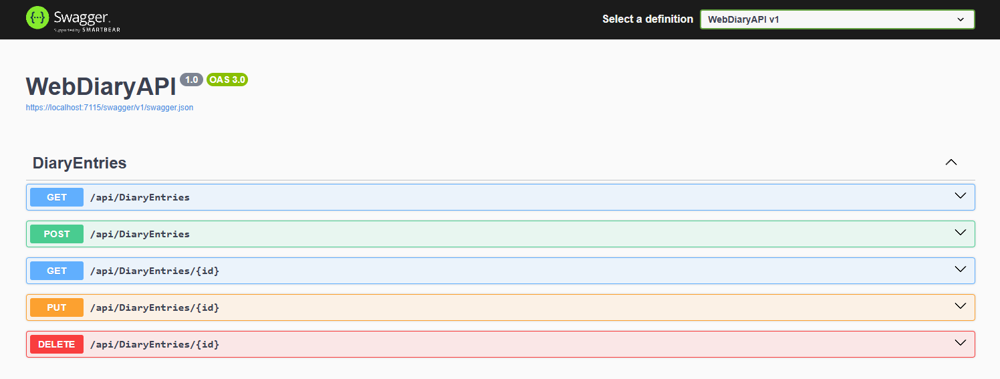
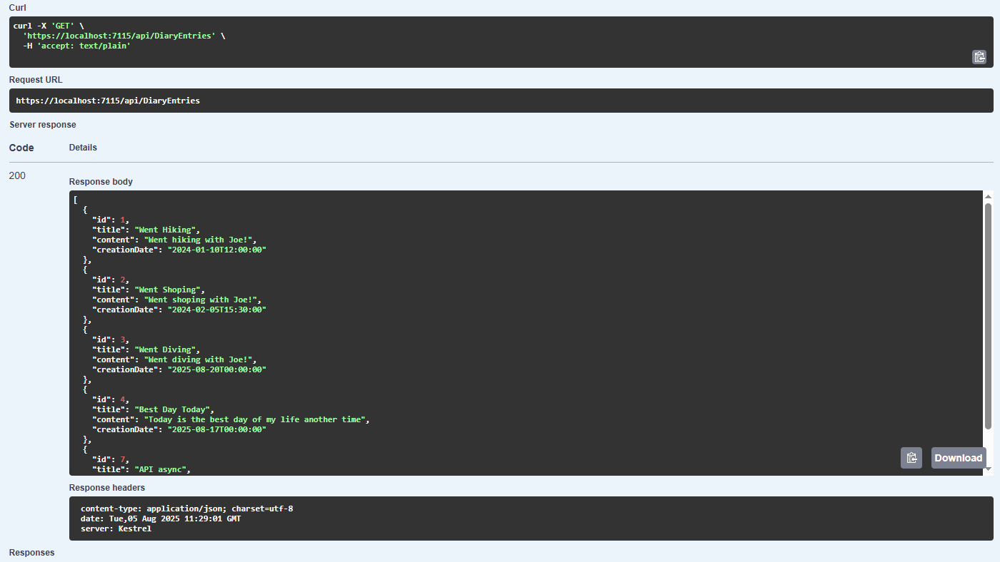
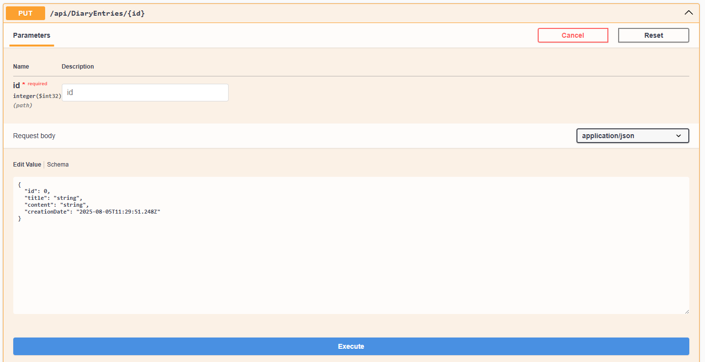

# 📔 WebDiaryAPI

  
  
  

A simple ASP.NET Core Web API for managing diary entries. Built with .NET 9, Entity Framework Core, and SQL Server.

## 🚀 Features

- 📝 Create, read, update, and delete diary entries
- 📅 Each entry has a title, content, and creation date
- 🔒 Model validation with data annotations
- 🗂️ RESTful API endpoints
- 🧪 Interactive API documentation with Swagger (OpenAPI)

## 🛠️ Tech Stack

- C# 13 / .NET 9
- ASP.NET Core Web API
- Entity Framework Core 9 (with SQL Server)
- Swashbuckle (Swagger UI)

## 📚 API Endpoints

| Method | Endpoint              | Description                  |
|--------|----------------------|------------------------------|
| GET    | `/api/DiaryEntries` | Get all diary entries        |
| GET    | `/api/DiaryEntries/{id}` | Get a diary entry by ID |
| POST   | `/api/DiaryEntries`  | Create a new diary entry  |
| PUT    | `/api/DiaryEntries/{id}` | Update an existing entry |
| DELETE | `/api/DiaryEntries/{id}` | Delete a diary entry     |

---

Made with ❤️ using ASP.NET Core.
